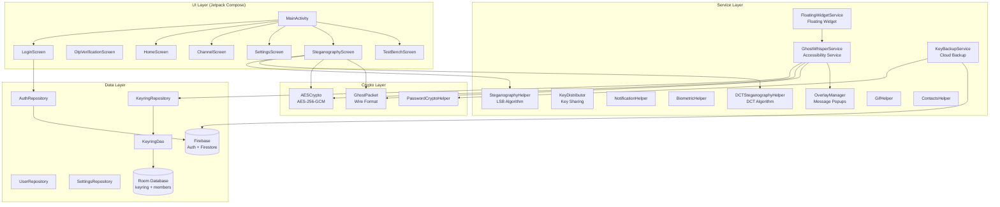
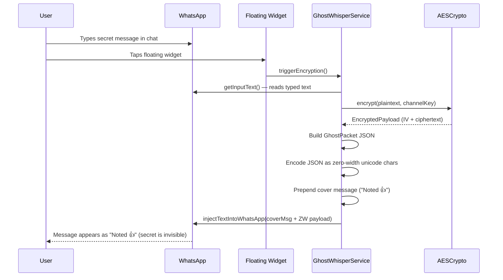
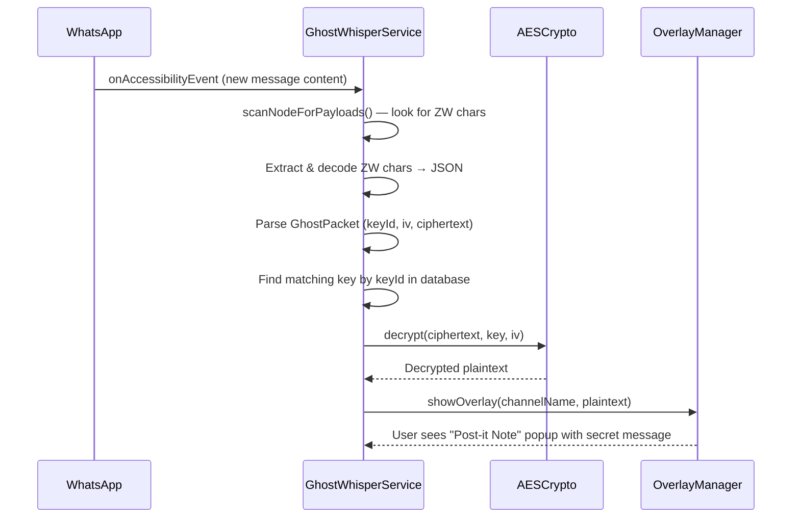
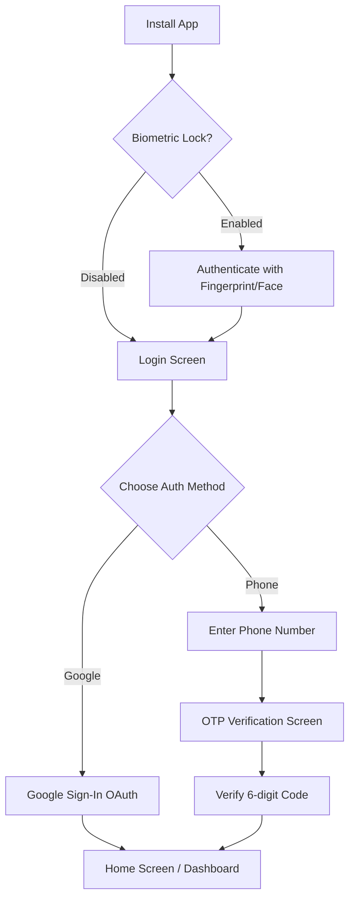
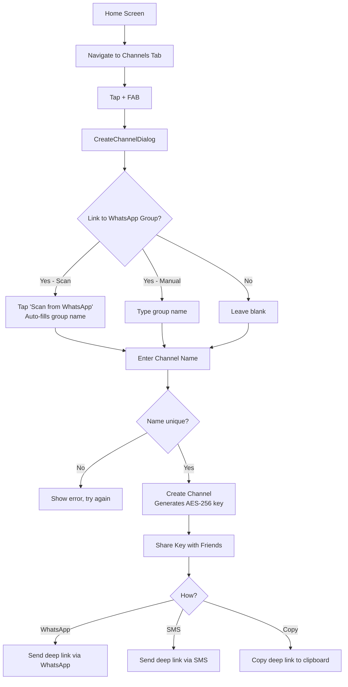
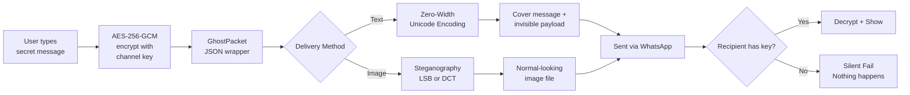

# Ghost Whisper — Complete Application Documentation

## 1. What Is Ghost Whisper?

Ghost Whisper is an Android application that enables **invisible, encrypted messaging inside WhatsApp**. Users can send and receive AES-256-GCM encrypted messages that are hidden within normal-looking WhatsApp messages — only people who share the same *channel key* can read the secret content. Everyone else sees only the cover message (e.g., "Noted 👍").

The app also supports **image steganography** — embedding encrypted messages inside images (PNG/GIF) so that secrets travel as innocent-looking photos.

---

## 2. Architecture Overview



---

## 3. Project Structure

```
com.ghostwhisper/
├── GhostWhisperApp.kt          # Application class (Firebase init)
├── crypto/
│   ├── AESCrypto.kt            # AES-256-GCM engine
│   └── PasswordCryptoHelper.kt # Password-based encryption for backups
├── data/
│   ├── db/
│   │   ├── KeyringDao.kt       # Room DAO
│   │   └── KeyringDatabase.kt  # Room database (v2)
│   ├── model/
│   │   ├── ChannelKey.kt       # Channel encryption key entity
│   │   ├── ChannelMember.kt    # Channel member entity
│   │   └── GhostPacket.kt      # Encrypted message wire format
│   └── repository/
│       ├── AuthRepository.kt   # Firebase Auth (Google + Phone)
│       ├── KeyringRepository.kt# Channel key + member management
│       ├── SettingsRepository.kt# SharedPreferences wrapper
│       └── UserRepository.kt   # Firestore user profiles
├── service/
│   ├── BiometricHelper.kt      # Fingerprint/face unlock
│   ├── ContactsHelper.kt       # Address book cross-reference
│   ├── DCTSteganographyHelper.kt# DCT steganography (compression-resistant)
│   ├── GhostWhisperService.kt  # Core accessibility service
│   ├── GifHelper.kt            # GIF frame extraction/assembly
│   ├── KeyBackupService.kt     # Cloud backup/restore
│   ├── KeyDistributor.kt       # Key sharing (WhatsApp/SMS/clipboard)
│   ├── NotificationHelper.kt   # Notification channels + builders
│   ├── OverlayManager.kt       # Decrypted message overlay popup
│   └── SteganographyHelper.kt  # LSB steganography
├── stegano/
│   └── (steganography utilities)
└── ui/
    ├── MainActivity.kt         # Auth gate + navigation + deep links
    ├── screens/
    │   ├── ChannelScreen.kt    # Channel CRUD, members, linking
    │   ├── HomeScreen.kt       # Dashboard + onboarding
    │   ├── LoginScreen.kt      # Google Sign-In + Phone
    │   ├── OtpVerificationScreen.kt # 6-digit OTP
    │   ├── SettingsScreen.kt   # Profile, security, toggles
    │   ├── SteganographyScreen.kt # Image encode/decode
    │   └── TestBenchScreen.kt  # Dev testing UI
    ├── theme/                  # Colors, typography, shapes
    └── widget/
        └── FloatingWidgetService.kt # Floating action bubble
```

---

## 4. Feature Breakdown

### 4.1 Authentication
| Feature | Details |
|---------|---------|
| **Google Sign-In** | OAuth via Firebase Auth. Branded button with Google colors and loading state. |
| **Phone + OTP** | Enter phone → receive 6-digit SMS → auto-verify or manual entry. |
| **Biometric Lock** | App-level fingerprint/face lock via `BiometricHelper`. Wraps the entire app via `AppLockWrapper`. |
| **User Profiles** | Stored in Firestore (`users/{uid}`). Tracks `lastActive` timestamp. |

### 4.2 Channel System (Core Feature)
Channels are the fundamental unit. Each channel has a **256-bit AES key** shared among its members.

| Feature | Details |
|---------|---------|
| **Create Channel** | Generates a fresh AES-256 key. Optionally link to a WhatsApp group and scan group name from the accessibility service. |
| **Key ID** | First 4 hex chars of `SHA-256(channelName)`. Used to identify which key decrypts a message. |
| **Channel Name Uniqueness** | Prevents creating duplicate channel names. |
| **WhatsApp Group Linking** | Link a channel to a specific WhatsApp group. The app auto-switches to the linked channel when you enter that group. |
| **Member Management** | Add members by phone number. Track key delivery status (Pending/Delivered/Failed). |
| **Member Set Uniqueness** | Within the same WhatsApp group, no two channels can have identical member sets. |
| **Key Distribution** | Share keys via WhatsApp message, SMS, or clipboard. Uses deep link format: `ghostwhisper://join?key=...&name=...` |
| **Deep Link Import** | Clicking a `ghostwhisper://join` link auto-imports the channel key. |
| **Cloud Backup** | Encrypt all channel keys with a user-chosen password → store in Firestore. Restore on new device. |
| **Cover Message** | Customizable innocent-looking text sent alongside the hidden payload (default: "Noted 👍"). |

### 4.3 Real-Time Encryption (Accessibility Service)
The `GhostWhisperService` is the heart of Ghost Whisper. It runs as an Android **Accessibility Service** and operates entirely within WhatsApp.

#### Encryption Flow (Sending)


#### Decryption Flow (Receiving)


> **Silent Fail**: If the user doesn't have the channel key, the message is simply ignored — no warning, no indication that a hidden message exists.

### 4.4 Floating Widget
A persistent floating bubble that appears over WhatsApp:

| State | Appearance | Meaning |
|-------|-----------|---------|
| `IDLE` | Default bubble | Widget is ready |
| `ACTIVE` | Green glow | User is typing in WhatsApp |
| `CHANNEL` | Purple + lock icon | A private channel is selected |
| `HIDDEN` | Not visible | WhatsApp is not in foreground |

- **Tap** → Triggers encryption of current typed text
- **Long press** → Opens steganography screen (launches with active channel pre-selected)

### 4.5 Image Steganography
Hide encrypted messages inside images — perfect for sharing via photo messages.

| Feature | Details |
|---------|---------|
| **LSB (Least Significant Bit)** | Fast, high capacity. Modifies pixel color values. Vulnerable to compression. |
| **DCT (Discrete Cosine Transform)** | Embeds in frequency domain. More resistant to JPEG compression. |
| **GIF Support** | Encode/decode across animated GIF frames. |
| **Encryption Integration** | Messages are AES-256-GCM encrypted (via `GhostPacket`) before embedding. |
| **Channel Selector** | Choose which channel's key to encrypt with. |
| **Silent Fail** | If you decode an image but don't have the key, it shows "No hidden message found" — no indication that a hidden message exists. |

### 4.6 Security Features
| Feature | Implementation |
|---------|---------------|
| **AES-256-GCM** | Authenticated encryption with 128-bit auth tag. Fresh 12-byte IV per message. |
| **Zero-Width Encoding** | Secret payload hidden in Unicode zero-width characters (invisible in WhatsApp). |
| **Clipboard Guard** | Strips zero-width characters from clipboard to prevent accidental secret leaks. |
| **Biometric Lock** | App-level fingerprint/face unlock. |
| **Plausible Deniability** | Silent fail on missing keys. Cover messages look natural. |
| **ProGuard** | Code obfuscation and shrinking rules configured for production builds. |

### 4.7 Other Features
- **Cloud Backup/Restore**: Password-encrypted key export to Firestore
- **Contact Cross-Reference**: Match phone contacts to channel members
- **Notifications**: Decrypted message notifications and key delivery status
- **TestBench Screen**: Developer testing UI for crypto operations

---

## 5. Data Flow

### 5.1 Data Models

#### ChannelKey (Room Entity: `keyring`)
| Field | Type | Description |
|-------|------|-------------|
| `keyId` | String (PK) | SHA-256(channelName) first 4 hex chars |
| `channelName` | String | Human-readable name |
| `aesKeyBase64` | String | Base64-encoded 256-bit AES key |
| `linkedGroupName` | String? | WhatsApp group name (auto-switch) |
| `coverMessage` | String | Innocent text sent with payloads |
| `creatorUid` | String? | Firebase UID of creator |
| `createdAt` | Long | Timestamp |
| `isActive` | Boolean | Soft-delete flag |

#### ChannelMember (Room Entity: `channel_members`)
| Field | Type | Description |
|-------|------|-------------|
| `id` | Long (PK) | Auto-generated |
| `channelKeyId` | String (FK) | Links to `ChannelKey.keyId` |
| `phoneNumber` | String | Member's phone |
| `contactName` | String | Display name |
| `role` | String | "admin" or "member" |
| `keyDeliveryStatus` | Enum | PENDING / DELIVERED / FAILED |

#### GhostPacket (Wire Format)
```json
{
  "v": 1,
  "kid": "8f3a",
  "iv": "base64-encoded-12-byte-IV",
  "ct": "base64-encoded-ciphertext-with-GCM-tag"
}
```
This JSON is encoded as zero-width Unicode characters for text-based messaging, or embedded as raw bytes for steganography.

### 5.2 Database
- **Room Database** (`KeyringDatabase`, version 2)
- **Tables**: `keyring`, `channel_members`
- **DAO**: `KeyringDao` with queries for channels (by name, group, keyId) and members
- **Migration**: v1→v2 adds `linkedGroupName`, `coverMessage`, `creatorUid` columns and the `channel_members` table

### 5.3 Firebase
- **Auth**: Google OAuth + Phone OTP
- **Firestore Collections**:
  - `users/{uid}` — profile data + `lastActive`
  - `users/{uid}/backups/latest` — encrypted key backup blob

---

## 6. User Flow

### 6.1 First Launch


### 6.2 Setting Up a Secret Channel


### 6.3 Sending a Secret Message (Text)
1. Open WhatsApp and go to the group/chat linked to your channel
2. The app auto-detects the group and activates the linked channel
3. Type your **secret message** in the WhatsApp input field
4. Tap the **floating widget bubble**
5. The service reads your typed text, encrypts it with AES-256-GCM, wraps it as a `GhostPacket`, encodes it as invisible zero-width characters, prepends the cover message, and replaces your typed text
6. Hit Send — the recipient sees "Noted 👍" but channel members see the Real Text via overlay popup

### 6.4 Receiving a Secret Message
1. While in WhatsApp, the accessibility service scans incoming messages for zero-width payloads
2. If found, it parses the `GhostPacket`, looks up the key by `keyId`
3. If you have the key → **overlay popup** shows the decrypted message
4. If you don't have the key → **nothing happens** (silent fail, plausible deniability)

### 6.5 Sending a Secret Image
1. Navigate to the **Steganography** tab
2. Choose **Encode** tab
3. Select an image (PNG or GIF)
4. Select a channel to encrypt with
5. Type your secret message
6. Choose algorithm (LSB or DCT)
7. Tap **Encode & Save** → encrypted message is embedded in the image
8. Share the image normally via WhatsApp, email, etc.

### 6.6 Receiving a Secret Image
1. Navigate to **Steganography** > **Decode** tab
2. Select the received image
3. The app attempts to extract and decrypt with all available channel keys
4. If successful → shows the decrypted message
5. If no key matches → shows "No hidden message found"

---

## 7. Setup Guide

### 7.1 Prerequisites
- Android Studio (latest stable)
- JDK 17+
- Android SDK 34+
- A physical Android device (accessibility services don't work well on emulators)

### 7.2 Firebase Setup
1. Create a Firebase project at [console.firebase.google.com](https://console.firebase.google.com)
2. Add an Android app with package name `com.ghostwhisper`
3. Download `google-services.json` → place it in `app/`
4. Enable **Authentication** providers:
   - Google Sign-In (copy the Web Client ID)
   - Phone Sign-In
5. Enable **Cloud Firestore** (start in test mode)
6. Add the Web Client ID to `strings.xml`:
   ```xml
   <string name="default_web_client_id">YOUR_WEB_CLIENT_ID</string>
   ```

### 7.3 Build & Install
```bash
# Clone the project
cd "Ghost Whisper"

# Build debug APK
./gradlew assembleDebug

# Install on device
adb install app/build/outputs/apk/debug/app-debug.apk
```

### 7.4 Device Permissions Setup
After installing, you must enable these permissions:

| Permission | How to Enable | Why |
|-----------|---------------|-----|
| **Accessibility Service** | Settings → Accessibility → Ghost Whisper → Enable | Core message interception |
| **Overlay Permission** | Settings → Apps → Ghost Whisper → Display over other apps | Floating widget + message popups |
| **Contacts** | Auto-prompted on first use | Member cross-referencing |
| **Storage** | Auto-prompted for steganography | Image read/write |

### 7.5 Quick Start
1. Launch app → Sign in with Google or Phone
2. Go to **Channels** tab → Tap **+** to create your first channel
3. Share the channel key with a friend (they tap the deep link to import)
4. Open WhatsApp → go to a chat → type a message → tap the floating widget
5. The message is now encrypted and invisible! Your friend will see it as a popup.

---

## 8. Testing Guide

### 8.1 Build Verification
```bash
# Full debug build (includes KSP code generation for Room)
./gradlew assembleDebug

# Run unit tests
./gradlew testDebugUnitTest
```

### 8.2 Testing the Encryption Flow
1. **Create two channels** on the same device (or use two devices)
2. **Activate Channel A** → go to WhatsApp → type "Secret Test Message" → tap widget
3. Verify the message becomes the cover text + invisible ZW payload
4. **Switch to the recipient device** (or use TestBench screen for manual encrypt/decrypt)
5. Verify the overlay popup shows "Secret Test Message"

### 8.3 Testing Silent Fail
1. **Device A**: Encode an image with a secret using Channel A
2. **Device B**: Does NOT have Channel A's key
3. **Device B**: Decode the image → should show "No hidden message found" (NOT "encrypted message found")
4. **Device B**: Import Channel A's key → Decode again → should show the secret

### 8.4 Testing WhatsApp Group Scan
1. Open WhatsApp → enter a group chat
2. Switch back to Ghost Whisper → Channels → tap **+**
3. Tap **"Scan from WhatsApp"** → should auto-fill the group name
4. Create the channel → verify it's linked
5. Go back to WhatsApp → enter the same group → verify auto-switch notification

### 8.5 Testing Channel Uniqueness
1. Create a channel named "Alpha"
2. Try to create another channel named "Alpha" → should show error "A channel with this name already exists"

### 8.6 Testing Key Backup/Restore
1. Go to Settings → Cloud Backup → enter a password → Backup
2. Uninstall and reinstall the app (or use a different device)
3. Sign in with the same account → Settings → Restore → enter the same password
4. Verify all channels are restored

### 8.7 Testing Steganography
1. **Encode**: Select PNG → choose channel → type message → encode → save
2. **Decode**: Open the saved image → verify the message appears
3. **Compression Test**: Share the encoded image via WhatsApp → download it → decode → test if DCT survives compression
4. **GIF Test**: Select an animated GIF → encode → decode → verify

### 8.8 TestBench Screen
The app includes a built-in **TestBench** screen (accessible from bottom navigation) for developers to:
- Manually test AES encryption/decryption
- Generate and verify GhostPackets
- Test zero-width encoding/decoding
- Verify key derivation

---

## 9. Key Technical Decisions

| Decision | Rationale |
|----------|-----------|
| **Accessibility Service** | Only way to read/inject text into WhatsApp without rooting the device |
| **Zero-Width Unicode** | Invisible in all chat apps. WhatsApp doesn't strip these characters. |
| **AES-256-GCM** | AEAD cipher — provides both confidentiality and integrity. NIST-approved. |
| **GhostPacket JSON** | Compact, self-describing wire format with key ID for multi-channel routing |
| **Room Database** | Local-first storage for keys. No network dependency for core crypto operations. |
| **Firebase Auth** | Easy Google/Phone login without managing passwords |
| **DCT Steganography** | Survives JPEG compression (WhatsApp re-compresses images) |
| **Silent Fail** | Critical for plausible deniability — users must not know a hidden message exists |

---

## 10. Security Model



**Threat model**: Ghost Whisper protects against passive observers who can read WhatsApp messages (e.g., shoulder surfing, chat exports, device seizure). It does NOT protect against a compromised device or a malicious accessibility service with higher priority.
