# Product Requirements Document (PRD) — Ghost Whisper

| Field | Value |
|---|---|
| **Version** | 1.0 |
| **Status** | Approved for Development |
| **Date** | February 14, 2026 |
| **Author** | Chhayansh Porwal |
| **Platform Priority** | Android (Primary), Web (Secondary) |
| **Core Philosophy** | *"Security through Invisibility"* |

---

## 1. Executive Summary

**Ghost Whisper** is a privacy-enhancement utility that overlays **end-to-end encrypted (E2EE), invisible communication channels** on top of existing messaging platforms—primarily WhatsApp.

It solves the problem of **"Group Context Privacy"**: enabling users to communicate privately with specific sub-groups (called *channels*) without leaving the main group chat and without alerting unauthorized members—including the platform host—that a secret conversation is occurring.

### 1.1. Problem Statement

In group messaging environments (e.g., class groups, work teams), users often need to communicate privately with a *subset* of the group. Current solutions—creating new groups, DMs, or switching apps—are visible, traceable, and disruptive. Ghost Whisper eliminates this friction by hiding encrypted messages *inside* normal-looking messages.

### 1.2. Target Users

| Persona | Use Case |
|---|---|
| **Students** | Private coordination within class groups without teacher visibility |
| **Privacy Advocates** | Censorship-resistant communication on commodity platforms |
| **Journalists / Activists** | Covert communication over monitored channels |
| **Enterprise Teams** | Sensitive sub-channel discussions within large team groups |

### 1.3. Goals & Success Metrics

| Goal | Metric |
|---|---|
| Invisible communication | Zero detectable artifacts to non-Ghost Whisper users |
| Reliable encryption | 100% AES-256-GCM decryption accuracy for valid keys |
| Zero-knowledge failure | 0 error signals leaked on failed decryption attempts |
| Usability | < 3 taps to send an encrypted message |

---

## 2. Functional Requirements

### 2.1. The "Ghost" Input Mechanism — Sender Side

| ID | Requirement | Priority |
|---|---|---|
| **FR-01** | **Accessibility Overlay:** Render a floating "Ghost Icon" (👻) that appears *only* when `com.whatsapp` is the active foreground package. | P0 |
| **FR-02** | **Channel Selection:** Long-pressing the icon opens a "Keyring Menu" for target audience selection: 🔓 Public (no encryption) or 👻 Private Channel \[Name\] (encrypted). | P0 |
| **FR-03** | **Text Injection:** Programmatically intercept text from the Android input field, encrypt it, and replace it with a *Cover Message* + *Invisible Payload* before the user hits send. | P0 |
| **FR-04** | **Stealth Mode (Chaffing):** Optionally inject random, meaningless zero-width characters into normal messages to defeat traffic analysis—making it impossible to distinguish secret messages from normal ones. | P1 |

### 2.2. The "Silent" Decryption Mechanism — Receiver Side

| ID | Requirement | Priority |
|---|---|---|
| **FR-05** | **Passive Scanning:** The Accessibility Service scans incoming message bubbles for Zero-Width Characters (`\u200B`, `\u200C`). | P0 |
| **FR-06** | **Silent Fail Protocol:** On payload detection, attempt decryption with *all* available keys. On **failure**, do **nothing** (no error, no notification). On **success**, render a custom overlay with the decrypted text. | P0 |

### 2.3. Key Management

| ID | Requirement | Priority |
|---|---|---|
| **FR-07** | **Channel Creation:** Users can generate a new "Channel," which creates a random 256-bit AES key and a human-readable channel name. | P0 |
| **FR-08** | **Offline Key Exchange:** Keys are shared via **QR Code** (in-person) or **One-Time Link** (clipboard copy). No server-side key storage. | P0 |
| **FR-09** | **Key Revocation:** Users can delete a channel key from their local keyring, immediately losing access to that channel. | P1 |
| **FR-10** | **Key Rotation:** Users can regenerate a channel key and redistribute it via QR/link. Old messages cannot be decrypted with the new key. | P2 |

### 2.4. Settings & Configuration

| ID | Requirement | Priority |
|---|---|---|
| **FR-11** | **Default Cover Messages:** Users can configure a list of context-aware cover messages (e.g., "Noted," "Understood," "Interesting point"). | P1 |
| **FR-12** | **Chaffing Toggle:** Global on/off switch for Stealth Mode across all messages. | P1 |
| **FR-13** | **Overlay Appearance:** Configurable overlay color, opacity, and auto-dismiss timeout. | P2 |
| **FR-14** | **App Lock:** Optional biometric/PIN lock for the Ghost Whisper settings screen. | P1 |

---

## 3. Technical Architecture

### 3.1. Technology Stack

| Component | Technology | Rationale |
|---|---|---|
| **Language** | Kotlin | Native Android performance; critical for Accessibility Services |
| **Core API** | `AccessibilityService` | Only way to read/write screen content across apps without root |
| **Encryption** | AES-256-GCM | Authenticated encryption—ensures confidentiality + integrity |
| **Steganography** | Zero-Width Unicode | `\u200B` (ZWSP) and `\u200C` (ZWNJ) for binary encoding |
| **Database** | Room (SQLite) | Local keyring storage (Channel Name → AES Key) |
| **UI Framework** | Jetpack Compose | Modern declarative UI for floating widget & settings |
| **Build System** | Gradle (Kotlin DSL) | Standard Android build toolchain |
| **Min SDK** | API 26 (Android 8.0) | AccessibilityService stability baseline |

### 3.2. System Architecture Diagram

```
┌─────────────────────────────────────────────────────────┐
│                    GHOST WHISPER APP                     │
│                                                         │
│  ┌──────────────┐  ┌──────────────┐  ┌───────────────┐  │
│  │  Settings UI │  │  Floating    │  │  Overlay      │  │
│  │  (Compose)   │  │  Widget      │  │  Renderer     │  │
│  └──────┬───────┘  └──────┬───────┘  └───────┬───────┘  │
│         │                 │                   │          │
│  ┌──────┴─────────────────┴───────────────────┴───────┐  │
│  │              GhostWhisperService                   │  │
│  │          (AccessibilityService Core)               │  │
│  └──────┬──────────────┬──────────────────┬───────────┘  │
│         │              │                  │              │
│  ┌──────┴───────┐ ┌────┴─────────┐ ┌─────┴──────────┐  │
│  │ SteganoCodec │ │  AESCrypto   │ │  KeyringDAO    │  │
│  │ (Encode/     │ │  (Encrypt/   │ │  (Room DB)     │  │
│  │  Decode ZW)  │ │   Decrypt)   │ │                │  │
│  └──────────────┘ └──────────────┘ └────────────────┘  │
└─────────────────────────────────────────────────────────┘
            │                           ▲
            ▼                           │
   ┌─────────────────┐         ┌────────────────┐
   │   WhatsApp       │         │  WhatsApp       │
   │   Input Field    │         │  Message Bubble │
   │   (Write)        │         │  (Read/Scan)    │
   └─────────────────┘         └────────────────┘
```

### 3.3. Core Module Breakdown

#### 3.3.1. `SteganoCodec` — Steganography Engine

**Responsibility:** Convert plaintext ↔ zero-width character strings.

| Function | Input | Output |
|---|---|---|
| `encode(text: String): String` | UTF-8 string | ZW-encoded binary string |
| `decode(zwString: String): String` | ZW-encoded string | Original UTF-8 string |

**Encoding Scheme:**
```
Character → UTF-8 bytes → Binary bits → ZW mapping
  'H' → 0x48 → 01001000 → \u200C\u200B\u200C\u200C\u200B\u200C\u200C\u200C
                             (0=\u200B, 1=\u200C)
```

#### 3.3.2. `AESCrypto` — Encryption Engine

**Responsibility:** Encrypt/decrypt messages using AES-256-GCM.

| Function | Parameters | Notes |
|---|---|---|
| `encrypt(plaintext, key)` | 256-bit key | Returns `(iv, ciphertext, authTag)` |
| `decrypt(ciphertext, key, iv)` | Same key + IV | Throws on auth failure |
| `generateKey()` | — | `SecureRandom` 256-bit key |

**Critical Constraints:**
- IV **must** be 12 bytes, generated fresh via `SecureRandom` for **every** encryption.
- Auth tag is 128 bits (appended to ciphertext by GCM).
- Keys are stored as Base64-encoded strings in Room.

#### 3.3.3. `KeyringDAO` — Key Storage

**Responsibility:** CRUD operations on the local keyring.

**Room Entity:**
```kotlin
@Entity(tableName = "keyring")
data class ChannelKey(
    @PrimaryKey val keyId: String,    // First 4 hex chars of SHA-256(channelName)
    val channelName: String,
    val aesKeyBase64: String,
    val createdAt: Long,
    val isActive: Boolean = true
)
```

#### 3.3.4. `GhostWhisperService` — Accessibility Service Core

**Responsibility:** Orchestrate all interaction with WhatsApp UI.

| Event | Action |
|---|---|
| `TYPE_WINDOW_STATE_CHANGED` | Detect when WhatsApp is in foreground → show widget |
| `TYPE_VIEW_TEXT_CHANGED` | Monitor input field for user typing → enable widget glow |
| `TYPE_VIEW_CLICKED` (Send button) | Intercept → encrypt → inject → allow send |
| `TYPE_WINDOW_CONTENT_CHANGED` | Scan new messages for ZW characters → attempt decrypt |

### 3.4. The Packet Structure

Every invisible payload is a JSON object → Base64 → binary → Zero-Width characters.

```json
{
  "v":   1,               // Protocol version (future-proofing)
  "kid": "8f3a",          // Key ID — first 4 hex chars of SHA-256(channelName)
  "iv":  "x9s8f...",      // Initialization Vector (Base64, 12 bytes)
  "ct":  "U2FsdGVk..."    // Cipher Text + Auth Tag (Base64)
}
```

**Packet Size Estimation:**
| Field | Size (bytes) |
|---|---|
| JSON overhead | ~30 |
| `kid` | 4 |
| `iv` (Base64) | 16 |
| `ct` (for 100-char message) | ~150 |
| **Total JSON** | **~200 bytes** |
| **ZW-encoded** | **~1600 ZW chars** |

> [!NOTE]
> WhatsApp's message character limit is ~65,000. A 1600-char ZW payload is well within limits and completely invisible in the UI.

### 3.5. Data Flow — Send Path

```mermaid
sequenceDiagram
    participant U as User
    participant W as Widget
    participant S as GhostWhisperService
    participant C as AESCrypto
    participant E as SteganoCodec
    participant WA as WhatsApp

    U->>W: Long-press → Select Channel
    W->>S: Channel "Study Group" active
    U->>WA: Types "Let's bunk class"
    S->>WA: Intercepts input field text
    S->>C: encrypt("Let's bunk class", channelKey)
    C-->>S: {iv, ciphertext}
    S->>E: encode(JSON{kid, iv, ct})
    E-->>S: ZW-encoded string
    S->>WA: Replaces input with "Noted 👍" + ZW payload
    U->>WA: Hits Send (sees "Noted 👍")
```



### 3.6. Data Flow — Receive Path


---

## 4. User Interface Design

### 4.1. Floating Widget States

| State | Appearance | Trigger |
|---|---|---|
| **A — Idle** | Semi-transparent ghost icon (👻) on right edge, 48dp | WhatsApp is foreground |
| **B — Active** | Icon glows **green**, slight pulse animation | User focuses on text input field |
| **C — Channel Active** | Icon turns **purple** with tiny 🔒 badge | A private channel is selected |
| **D — Hidden** | Widget not visible | WhatsApp is not foreground |

### 4.2. Keyring Menu (Long-Press)

```
┌─────────────────────────┐
│  🔑 Select Channel      │
│─────────────────────────│
│  🔓  Public (Normal)    │
│  👻  Study Group         │
│  👻  Project Team        │
│  ─ ─ ─ ─ ─ ─ ─ ─ ─ ─  │
│  ➕  New Channel...      │
└─────────────────────────┘
```

### 4.3. Decrypted Message Overlay ("Post-it Note")

```
┌─────────────────────────────────┐
│  👻 Study Group            [✕]  │
│─────────────────────────────────│
│                                 │
│  "Let's bunk class and go      │
│   to the canteen"              │
│                                 │
│─────────────────────────────────│
│  [↩ Reply]         [📋 Copy]   │
└─────────────────────────────────┘
```

- **Reply** button auto-selects the same channel and focuses the input field.
- **Copy** copies decrypted text to clipboard.
- Auto-dismiss after configurable timeout (default: 10 seconds).

### 4.4. Settings Screen

```
┌────────────────────────────────────────┐
│  ⚙️  Ghost Whisper Settings            │
│────────────────────────────────────────│
│                                        │
│  🔑 My Channels                        │
│     Study Group ··················· 🗑  │
│     Project Team ·················· 🗑  │
│     [+ Create New Channel]             │
│                                        │
│  🛡 Security                           │
│     App Lock ··················· [ON]  │
│     Chaffing Mode ·············· [OFF] │
│                                        │
│  💬 Cover Messages                     │
│     "Noted" ························ ✏  │
│     "Understood" ···················· ✏  │
│     [+ Add Cover Message]             │
│                                        │
│  🎨 Appearance                         │
│     Overlay Color ··········· [Purple] │
│     Overlay Timeout ··········· [10s]  │
│     Widget Size ·············· [48dp]  │
│                                        │
│  ℹ️ About                              │
│     Version 1.0 | Open Source          │
└────────────────────────────────────────┘
```

### 4.5. Key Sharing Screen

| Method | Flow |
|---|---|
| **QR Code** | Display QR containing `ghostwhisper://join?key=<base64>&name=<channelName>` |
| **One-Time Link** | Copy deep-link to clipboard: `ghostwhisper://join?key=<base64>&name=<channelName>` |

---

## 5. Non-Functional Requirements

| ID | Requirement | Target |
|---|---|---|
| **NFR-01** | Encryption latency | < 50ms for messages ≤ 500 chars |
| **NFR-02** | ZW encoding latency | < 100ms for messages ≤ 500 chars |
| **NFR-03** | Widget render latency | < 200ms from WhatsApp foreground |
| **NFR-04** | Battery impact | < 3% daily drain from Accessibility Service |
| **NFR-05** | Memory footprint | < 30 MB resident memory |
| **NFR-06** | Crash rate | < 0.1% per session |
| **NFR-07** | Offline capability | 100% functional without internet (all logic is local) |
| **NFR-08** | Device compatibility | Android 8.0+ (API 26+), ARM64 & x86_64 |

---

## 6. Edge Cases & Failure Modes

| Scenario | Expected Behavior |
|---|---|
| WhatsApp updates input field ID | Graceful degradation — widget shows "Cannot detect input field" warning |
| Message exceeds ZW payload limit | Truncate or split into multiple messages with sequence numbering |
| Multiple Ghost Whisper messages in one chat | Each scanned independently; overlays stack vertically |
| User installs app but has no keys | App shows onboarding: "Create or join a channel to get started" |
| QR code scanned with camera (not Ghost Whisper) | Opens deep link → if app installed, imports key; if not, shows Play Store / GitHub link |
| WhatsApp Web / Desktop | ZW characters are preserved across platforms; Web extension (Phase 2) can decode them |
| Group chat with mixed users | Ghost Whisper users see decrypted overlays; others see only the cover message |
| Battery Saver / Doze mode kills service | Use `START_STICKY` + `ForegroundService` with a silent persistent notification |
| OEM battery optimization (Xiaomi/Samsung) | In-app guide to whitelist Ghost Whisper from battery optimization |

---

## 7. Risks & Compliance

### 7.1. Google Play Store — Accessibility Service Risk

> [!CAUTION]
> Google Play aggressively bans apps using `AccessibilityService` for non-accessibility purposes. This is the **#1 distribution risk**.

| Strategy | Feasibility | Recommendation |
|---|---|---|
| **Play Store (A11y justification)** | Low — Google may reject | Not recommended for v1 |
| **GitHub / F-Droid (APK sideload)** | High — no gatekeeper | **Primary distribution** |
| **Progressive Web App (Web)** | Medium — limited OS access | Secondary platform (Phase 2) |

### 7.2. Broken Context Risk

**Problem:** Cover messages can create suspicious conversational context.

**Mitigations:**
1. Context-aware cover message suggestions (built-in library).
2. "Smart Cover" mode that analyzes recent chat context (future ML feature).
3. User education tooltip on first use.

### 7.3. WhatsApp Terms of Service

| Risk | Impact | Mitigation |
|---|---|---|
| WhatsApp detecting ZW injection | Account ban (unlikely — ZW is valid Unicode) | Chaffing mode normalizes traffic patterns |
| WhatsApp stripping ZW characters | Messages become unreadable | Monitor WhatsApp updates; fallback encoding schemes |
| Reverse engineering by WhatsApp | Pattern detection | Open-source allows community audits and rapid adaptation |

---

## 8. Implementation Roadmap

### Phase 1 — The "Hiding" Engine (Weeks 1–2)

| Task | Deliverable |
|---|---|
| Build `SteganoCodec` class | Text ↔ ZW string conversion |
| Build `AESCrypto` class | AES-256-GCM encrypt/decrypt with `SecureRandom` IV |
| Build test app | Two text boxes: Type → Encrypt → Copy → Paste → Decrypt |
| **Milestone** | End-to-end encrypt/decrypt working in isolation |

### Phase 2 — The Service Injection (Weeks 3–4)

| Task | Deliverable |
|---|---|
| Implement `AccessibilityService` | Detect WhatsApp foreground state |
| Read input field content | Logcat prints typed text from WhatsApp input |
| Write to input field | Programmatically replace input field text |
| **Milestone** | Service can read and write WhatsApp input field |

### Phase 3 — The Overlay & KeyStore (Weeks 5–6)

| Task | Deliverable |
|---|---|
| Build Room database (`KeyringDAO`) | CRUD for channel keys |
| Build Floating Widget (Compose) | All 4 states (Idle/Active/Channel/Hidden) |
| Build decryption overlay | Post-it note with Reply and Copy |
| Integrate full pipeline | Type → Widget → Encrypt → Inject → Send |
| **Milestone** | Full send/receive working between two devices |

### Phase 4 — Optimization & Hardening (Week 7+)

| Task | Deliverable |
|---|---|
| Refine Silent Fail logic | Zero-leakage decryption attempts |
| OEM compatibility testing | Samsung, Xiaomi, OnePlus, Pixel |
| Battery optimization | ForegroundService + user whitelisting guide |
| QR code key sharing | Camera-based key import |
| **Milestone** | Production-ready APK for GitHub release |

---

## 9. Testing Strategy

| Test Type | Scope | Tools |
|---|---|---|
| **Unit Tests** | `SteganoCodec`, `AESCrypto`, `KeyringDAO` | JUnit 5, MockK |
| **Integration Tests** | Full encrypt → encode → decode → decrypt pipeline | AndroidX Test |
| **UI Tests** | Widget states, overlay rendering, settings | Espresso, Compose Testing |
| **Accessibility Service Tests** | WhatsApp interaction (manual) | Real device, Logcat |
| **Cross-Device Tests** | OEM compatibility | Samsung, Xiaomi, OnePlus, Pixel |
| **Security Audit** | Key storage, memory safety, side-channel leaks | Manual + static analysis |

---

## 10. Future Scope (Post v1.0)

| Feature | Description | Priority |
|---|---|---|
| **Web Extension** | Chrome/Firefox extension to decode ZW in WhatsApp Web | P1 |
| **Multi-Platform Support** | Telegram, Signal, Instagram DMs | P2 |
| **Group Key Agreement** | Diffie-Hellman for automatic group key negotiation | P2 |
| **Disappearing Messages** | Auto-delete decrypted overlay after X seconds | P2 |
| **Smart Covers (ML)** | AI-generated context-aware cover messages | P3 |
| **File Steganography** | Hide payloads in images (LSB encoding) | P3 |

---

## Appendix A: Glossary

| Term | Definition |
|---|---|
| **ZW** | Zero-Width Unicode characters (invisible) |
| **ZWSP** | Zero-Width Space (`\u200B`) |
| **ZWNJ** | Zero-Width Non-Joiner (`\u200C`) |
| **Kid** | Key Identifier — first 4 hex chars of SHA-256 hash of channel name |
| **IV** | Initialization Vector — random nonce for each encryption |
| **GCM** | Galois/Counter Mode — authenticated encryption mode |
| **Chaffing** | Injecting decoy data to defeat traffic analysis |
| **Cover Message** | The visible, innocent-looking text sent alongside the hidden payload |
| **Silent Fail** | Decryption failure produces zero observable output |

## Appendix B: Deep Link Schema

```
ghostwhisper://join?key=<base64_aes_key>&name=<channel_name>
```

| Parameter | Type | Description |
|---|---|---|
| `key` | Base64 String | The raw 256-bit AES key, URL-safe Base64 encoded |
| `name` | String | Human-readable channel name (URL-encoded) |
