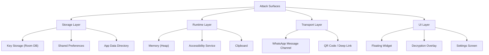
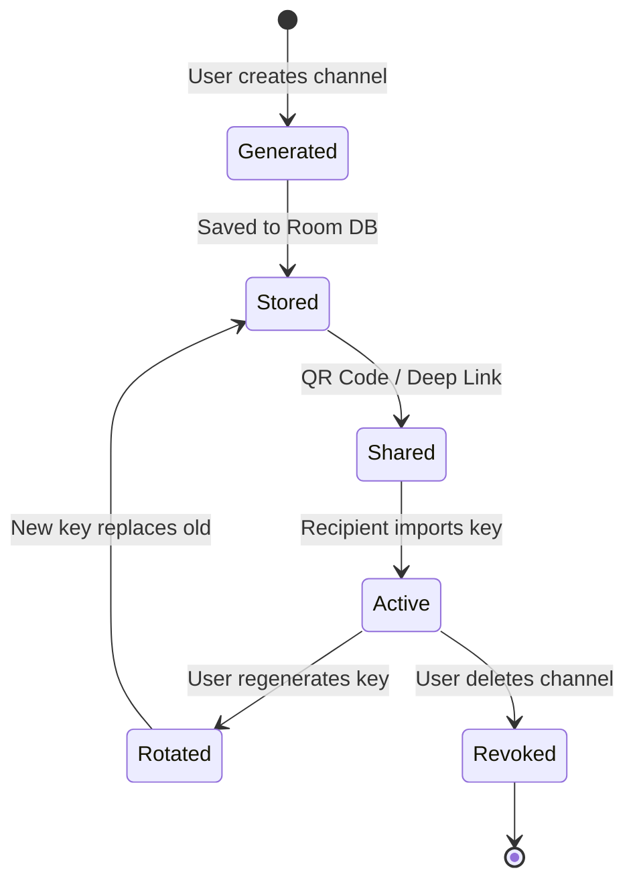

# Security & Safety Document — Ghost Whisper

| Field | Value |
|---|---|
| **Version** | 1.0 |
| **Date** | February 14, 2026 |
| **Author** | Chhayansh Porwal |
| **Classification** | Internal — Development Reference |
| **Status** | Active |

---

## 1. Security Overview

Ghost Whisper is a **zero-trust, offline-first** privacy tool. Its security model is built on three pillars:

| Pillar | Principle |
|---|---|
| **Invisibility** | Hidden messages are undetectable to non-users |
| **Zero Knowledge** | Failed decryption reveals nothing—no errors, no signals |
| **Local-Only Trust** | No servers, no cloud, no network dependency for core functions |

> [!IMPORTANT]
> Ghost Whisper never transmits encryption keys over the network. All key exchange is offline (QR code or local clipboard). The app has **zero network permissions**.

---

## 2. Threat Model

### 2.1. Adversary Profiles

| Adversary | Capability | Goal |
|---|---|---|
| **Passive Observer** | Can read WhatsApp messages (e.g., teacher in group) | Detect hidden communication |
| **Curious Device User** | Has temporary access to an unlocked phone | Extract keys or read secret messages |
| **Platform Operator (WhatsApp)** | Full server-side message access | Detect steganographic content |
| **Forensic Analyst** | Full device access (rooted, disk image) | Recover keys and decrypt messages |
| **Active Attacker** | Can modify messages in transit | Tamper with or forge hidden payloads |

### 2.2. Attack Surface Map



---

## 3. Cryptographic Security

### 3.1. Algorithm Specification

| Property | Value |
|---|---|
| **Algorithm** | AES-256-GCM (NIST SP 800-38D) |
| **Key Size** | 256 bits (32 bytes) |
| **IV Size** | 96 bits (12 bytes) — per NIST recommendation |
| **Auth Tag Size** | 128 bits (16 bytes) |
| **Key Derivation** | `SecureRandom` (Android Keystore-backed CSPRNG) |
| **Encoding** | Base64 (URL-safe, no padding) for wire format |

### 3.2. Cryptographic Guarantees

| Property | Guaranteed By |
|---|---|
| **Confidentiality** | AES-256 encryption (2^256 keyspace) |
| **Integrity** | GCM authentication tag (detects tampering) |
| **Freshness** | Unique random IV per message (prevents replay) |
| **Forward Secrecy** | ❌ Not provided — compromise of a key decrypts all past messages using that key |

> [!WARNING]
> **Forward Secrecy Limitation:** Ghost Whisper uses symmetric keys. If a channel key is compromised, all past and future messages encrypted with that key are exposed. Mitigation: periodic key rotation (FR-10).

### 3.3. Cryptographic Rules (MUST Follow)

| Rule | Rationale | Violation Impact |
|---|---|---|
| **Never reuse an IV** with the same key | IV reuse in GCM mode is catastrophic — enables key recovery | Complete security breakdown |
| **Always use `SecureRandom`** for IV and key generation | Predictable randomness = predictable keys | Key prediction attacks |
| **Never log keys, IVs, or plaintext** | Logcat is readable by other apps on debug builds | Key/data leakage |
| **Zero plaintext in memory** after use | GC is non-deterministic; plaintext may persist in heap | Memory dump attacks |
| **Validate auth tag** before processing decrypted data | Prevents oracle attacks on malformed ciphertext | Chosen-ciphertext attacks |

### 3.4. IV Management

```kotlin
// CORRECT — fresh IV every time
fun encrypt(plaintext: ByteArray, key: SecretKey): EncryptedPacket {
    val iv = ByteArray(12)
    SecureRandom().nextBytes(iv)  // CSPRNG
    val cipher = Cipher.getInstance("AES/GCM/NoPadding")
    cipher.init(Cipher.ENCRYPT_MODE, key, GCMParameterSpec(128, iv))
    val ciphertext = cipher.doFinal(plaintext)
    return EncryptedPacket(iv, ciphertext)
}

// WRONG — reusing IV (NEVER DO THIS)
// val iv = "fixed_iv_value".toByteArray()  // ❌ CATASTROPHIC
```

---

## 4. Key Management Security

### 4.1. Key Lifecycle



### 4.2. Key Storage Security

| Layer | Mechanism | Protection Against |
|---|---|---|
| **Database Encryption** | SQLCipher (encrypted Room DB) | Physical device access, disk imaging |
| **Android Keystore** | Hardware-backed key for DB encryption key | Root-level key extraction |
| **App Sandbox** | Android process isolation | Other apps reading key files |
| **App Lock** | Biometric / PIN gate on settings | Casual device access |

**Implementation:**

```kotlin
// DB encryption key is stored in Android Keystore (hardware-backed)
val masterKey = MasterKey.Builder(context)
    .setKeyScheme(MasterKey.KeyScheme.AES256_GCM)
    .build()

// Room database is encrypted with SQLCipher
val db = Room.databaseBuilder(context, KeyringDatabase::class.java, "keyring.db")
    .openHelperFactory(SupportFactory(getPassphrase(masterKey)))
    .build()
```

### 4.3. Key Exchange Security

| Method | Security Level | Threat Mitigated |
|---|---|---|
| **QR Code (In-Person)** | 🟢 High | No digital transmission; visual verification |
| **Deep Link (Clipboard)** | 🟡 Medium | Clipboard may be read by other apps |
| **Network Transfer** | 🔴 Not Supported | Eliminates MITM, server compromise |

> [!CAUTION]
> **Clipboard Risk:** When using the One-Time Link method, the AES key is temporarily in the system clipboard. Malicious apps with clipboard access can steal it. Mitigations:
> 1. Clear clipboard immediately after paste (5-second auto-clear).
> 2. Warn user during key share: *"Key copied. Paste it soon — clipboard will be cleared in 5 seconds."*
> 3. Prefer QR code exchange for maximum security.

### 4.4. Key ID Collision Analysis

Key IDs use the first 4 hex characters of `SHA-256(channelName)`, yielding 16^4 = 65,536 possible IDs.

| Keyring Size | Collision Probability (Birthday Bound) |
|---|---|
| 10 channels | ~0.07% |
| 50 channels | ~1.9% |
| 100 channels | ~7.3% |

**Mitigation for collisions:** On `kid` match, attempt decryption. GCM authentication will reject wrong keys with overwhelming probability (2^-128 false positive rate).

---

## 5. Steganographic Security

### 5.1. Detection Resistance

| Attack | Risk Level | Defense |
|---|---|---|
| **Visual Inspection** | 🟢 None | ZW characters are invisible in all rendering engines |
| **Character Count Analysis** | 🟡 Medium | Message length differs from visible text length |
| **Unicode Category Filtering** | 🔴 High | Automated scanners can detect `\u200B`/`\u200C` clusters |
| **Statistical Analysis** | 🟡 Medium | Non-Ghost Whisper messages have zero ZW chars |

### 5.2. Chaffing — Traffic Analysis Defense

**Problem:** Without chaffing, an observer can compare:
- Messages from Ghost Whisper users (contain ZW chars)
- Messages from normal users (zero ZW chars)

**Solution — FR-04 Stealth Mode:**

```
Normal message:     "Hello everyone"
With chaffing:      "Hel\u200Blo\u200C ev\u200Beryo\u200Cne"     (random ZW injection)
With hidden msg:    "Noted 👍\u200B\u200C\u200B\u200C..."         (structured ZW payload)
```

When chaffing is active, **every** message contains ZW characters, making it statistically impossible to distinguish real payloads from noise.

**Chaffing Parameters:**
| Parameter | Value | Rationale |
|---|---|---|
| Injection Rate | 1 ZW char per 3–7 visible chars (random) | Mimics natural distribution |
| Characters Used | Same as payload (`\u200B`, `\u200C`) | No distinguishing charset |
| Pattern | Random, non-decodable | Must not form valid packets |

### 5.3. Platform Stripping Risk

| Platform | ZW Character Behavior | Risk |
|---|---|---|
| **WhatsApp Android** | Preserved ✅ | None (verified) |
| **WhatsApp iOS** | Preserved ✅ | None |
| **WhatsApp Web** | Preserved ✅ | None |
| **Telegram** | Preserved ✅ | None |
| **Instagram DMs** | Stripped ❌ | Not compatible |
| **Twitter/X DMs** | Stripped ❌ | Not compatible |

> [!NOTE]
> WhatsApp's message encoding preserves all Unicode characters including zero-width ones. This is critical to Ghost Whisper's viability and should be monitored with each WhatsApp update.

---

## 6. Runtime Security

### 6.1. Memory Safety

| Threat | Mitigation |
|---|---|
| **Plaintext in heap** | Overwrite `ByteArray` with zeros after use; avoid `String` for secrets (immutable, GC-dependent) |
| **Key material in memory** | Load keys on-demand, clear after use; never cache in static fields |
| **Accessibility Service memory** | Service runs in app process; standard Android sandbox applies |

**Secure Memory Pattern:**
```kotlin
fun decryptAndDisplay(packet: EncryptedPacket, key: ByteArray) {
    val plaintext = ByteArray(0) // placeholder
    try {
        val result = AESCrypto.decrypt(packet.ct, key, packet.iv)
        // Copy to plaintext
        result.copyInto(plaintext)
        showOverlay(String(plaintext, Charsets.UTF_8))
    } finally {
        // Zero out sensitive data
        plaintext.fill(0)
        key.fill(0)  // Only if key is a copy
    }
}
```

### 6.2. Accessibility Service Security

| Risk | Description | Mitigation |
|---|---|---|
| **Over-privileged access** | Service can read ALL screen content | Filter events: only process `com.whatsapp` package |
| **Event logging** | Android may log accessibility events | Disable all logging in release builds |
| **Service hijacking** | Malicious app impersonates our service | Android OS ensures only one service per package; signed APK verification |

**Service Configuration (Minimal Permissions):**
```xml
<accessibility-service
    android:accessibilityEventTypes="typeWindowStateChanged|typeViewTextChanged|typeWindowContentChanged"
    android:accessibilityFeedbackType="feedbackGeneric"
    android:notificationTimeout="100"
    android:packageNames="com.whatsapp"
    android:canRetrieveWindowContent="true"
    android:settingsActivity=".SettingsActivity" />
```

> [!IMPORTANT]
> `android:packageNames="com.whatsapp"` restricts the service to **only** WhatsApp events. This is both a privacy safeguard and a performance optimization.

### 6.3. Clipboard Security

| Scenario | Risk | Mitigation |
|---|---|---|
| Key sharing via clipboard | Other apps read clipboard | Auto-clear after 5 seconds |
| Cover message + payload | Clipboard may contain payload if user copies | Strip ZW chars on copy-out from Ghost Whisper |
| Android 12+ clipboard toast | System shows "App pasted from clipboard" | Expected behavior; no mitigation needed |

---

## 7. Data Privacy

### 7.1. Data Classification

| Data Type | Classification | Storage | Encryption |
|---|---|---|---|
| **AES Channel Keys** | 🔴 Critical | Room DB (SQLCipher) | AES-256-GCM via Android Keystore |
| **Channel Names** | 🟡 Sensitive | Room DB (SQLCipher) | Encrypted with DB |
| **Cover Message Templates** | 🟢 Non-Sensitive | SharedPreferences | None needed |
| **App Settings** | 🟢 Non-Sensitive | SharedPreferences | None needed |
| **Decrypted Messages** | 🔴 Critical | ❌ Never stored | In-memory only, zeroed after display |
| **Message History** | ❌ Not collected | ❌ N/A | N/A |

### 7.2. Data Flow Audit

```
╔══════════════════════════════════════════════════════════════╗
║                    DATA NEVER LEAVES DEVICE                  ║
╠══════════════════════════════════════════════════════════════╣
║                                                              ║
║  User Input ──► Encrypt ──► ZW Encode ──► WhatsApp Send     ║
║       │              │            │              │           ║
║  [In Memory]   [In Memory]  [In Memory]   [WhatsApp's       ║
║  [Zeroed]      [Zeroed]     [Zeroed]       Problem Now]     ║
║                                                              ║
║  WhatsApp Recv ──► ZW Decode ──► Decrypt ──► Overlay         ║
║       │               │            │           │             ║
║  [Screen Only]   [In Memory]  [In Memory]  [In Memory]      ║
║                  [Zeroed]     [Zeroed]     [Auto-dismiss]    ║
║                                                              ║
╚══════════════════════════════════════════════════════════════╝
```

### 7.3. Privacy Guarantees

| Guarantee | Implementation |
|---|---|
| **No analytics / telemetry** | Zero network permissions; no tracking SDKs |
| **No crash reporting** | No Firebase Crashlytics or equivalent |
| **No user accounts** | No registration, no email, no phone number |
| **No cloud sync** | All data is device-local |
| **No message logging** | Decrypted content is never written to disk |
| **Open source** | Full source code available for audit |

---

## 8. Distribution & Supply Chain Security

### 8.1. APK Signing

| Property | Value |
|---|---|
| **Signing Scheme** | APK Signature Scheme v2 + v3 |
| **Key Algorithm** | RSA 4096-bit |
| **Keystore** | Offline, password-protected `.jks` file |
| **Key Rotation** | Supported via v3 scheme if key is compromised |

### 8.2. Build Reproducibility

| Measure | Implementation |
|---|---|
| **Deterministic builds** | Pin all Gradle dependency versions |
| **Dependency verification** | Gradle dependency verification checksums |
| **CI/CD** | GitHub Actions with pinned runner images |
| **SBOM** | Generate Software Bill of Materials with each release |

### 8.3. Distribution Channels

| Channel | Integrity Verification |
|---|---|
| **GitHub Releases** | SHA-256 checksums published alongside APK |
| **F-Droid** | Built from source by F-Droid's reproducible build system |
| **Direct APK** | Users verify APK signature fingerprint against published value |

---

## 9. Incident Response Plan

### 9.1. Severity Classification

| Level | Description | Example |
|---|---|---|
| **P0 — Critical** | Cryptographic break or key leakage | IV reuse discovered in production |
| **P1 — High** | Security bypass or data exposure | Keys visible in logcat on release build |
| **P2 — Medium** | Feature-level security gap | Clipboard not cleared after key share |
| **P3 — Low** | Cosmetic or UX-level security issue | Overlay briefly visible in app switcher |

### 9.2. Response Procedures

| Severity | Response Time | Action |
|---|---|---|
| **P0** | < 4 hours | Immediate hotfix; publish advisory; revoke affected release |
| **P1** | < 24 hours | Patch release; notify users via GitHub |
| **P2** | Next release cycle | Fix in upcoming version |
| **P3** | Best-effort | Track in issue backlog |

### 9.3. Vulnerability Disclosure

| Property | Value |
|---|---|
| **Contact** | `security@ghostwhisper.dev` (or GitHub Security Advisory) |
| **PGP Key** | Published in repository `SECURITY.md` |
| **Disclosure Policy** | 90-day coordinated disclosure |
| **Bug Bounty** | Not applicable (student project) |

---

## 10. Compliance & Legal Considerations

### 10.1. Regulatory Landscape

| Regulation | Applicability | Ghost Whisper's Position |
|---|---|---|
| **GDPR (EU)** | If used by EU residents | ✅ Compliant — no personal data collected or transmitted |
| **IT Act 2000 (India)** | Indian users | ⚠️ Encryption is legal; interception tools may face scrutiny |
| **COPPA (US)** | Users under 13 | ✅ No data collection = no COPPA obligations |
| **Google Play Policy** | If distributed via Play Store | ❌ Accessibility Service use likely violates policy |

### 10.2. Ethical Use Policy

> [!WARNING]
> Ghost Whisper is designed for **legitimate privacy use cases**. The developers do not endorse or support its use for:
> - Illegal communication
> - Harassment or bullying
> - Academic dishonesty
> - Circumventing lawful surveillance orders

### 10.3. Open Source License

| Property | Value |
|---|---|
| **License** | MIT License (recommended) or GPL v3 |
| **Patent Grant** | Included (if Apache 2.0 chosen) |
| **Contributor Agreement** | DCO (Developer Certificate of Origin) sign-off |

---

## 11. Security Testing Checklist

### 11.1. Pre-Release Security Gate

- [ ] **Crypto Tests:** Verify AES-256-GCM encrypt/decrypt with known test vectors (NIST SP 800-38D).
- [ ] **IV Uniqueness:** Confirm no IV reuse across 10,000 consecutive encryptions.
- [ ] **Key Storage:** Verify Room DB is encrypted with SQLCipher; raw `.db` file is unreadable.
- [ ] **Memory Wipe:** Use Android Profiler to confirm plaintext and keys are zeroed after use.
- [ ] **Logcat Audit:** `grep -i "key\|secret\|password\|plaintext"` on release build logcat → zero results.
- [ ] **Clipboard Clear:** Verify clipboard is emptied within 5 seconds of key copy.
- [ ] **Silent Fail:** Send encrypted message; verify non-keyholder device shows zero indication.
- [ ] **Chaffing Validation:** Compare ZW distribution in chaffed vs. payload messages → statistically indistinguishable.
- [ ] **Service Scope:** Verify Accessibility Service ignores events from non-WhatsApp apps.
- [ ] **App Lock:** Verify biometric/PIN blocks access to settings and keyring.
- [ ] **APK Signing:** Verify APK is signed with v2+v3 scheme; certificate fingerprint matches published value.
- [ ] **Dependency Audit:** Run `./gradlew dependencyCheckAnalyze` — zero known CVEs in dependencies.

### 11.2. Ongoing Security Practices

| Practice | Frequency |
|---|---|
| Dependency CVE scan | Every build (CI/CD) |
| WhatsApp ZW preservation test | Every WhatsApp update |
| Manual penetration testing | Each major release |
| Code review (crypto modules) | Every PR touching `AESCrypto` or `SteganoCodec` |

---

## 12. Known Limitations & Honest Disclosure

| Limitation | Impact | User Guidance |
|---|---|---|
| **No forward secrecy** | Key compromise exposes all past messages with that key | Rotate keys periodically |
| **Symmetric keys only** | All channel members share the same key; no individual accountability | Trust your channel members |
| **No message authentication per-sender** | Any channel member can forge messages as another member | This is a group chat tool, not an identity system |
| **WhatsApp dependency** | If WhatsApp strips ZW chars, Ghost Whisper breaks | Monitor updates; fallback plan needed |
| **Accessibility Service dependency** | Android OEMs may kill the service; Google may restrict the API | User must whitelist app; sideload distribution |
| **4-char Key ID collisions** | Possible with many channels (see §4.4) | GCM auth tag prevents wrong-key decryption |

---

*This document should be reviewed and updated with each major release. All contributors working on cryptographic or security-sensitive code must read and acknowledge this document before submitting changes.*
